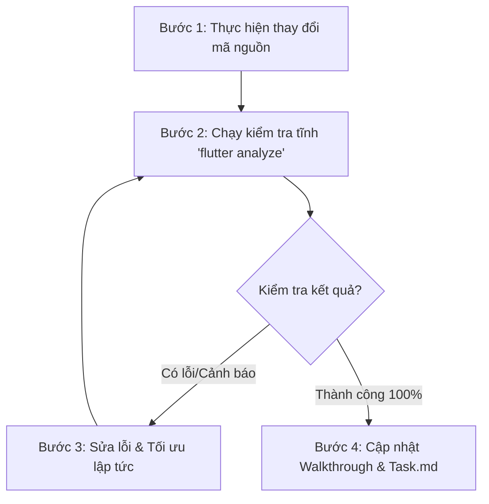

# Quy Tắc Biên Dịch & Phát Triển Mã Nguồn Nghiêm Ngặt (Strict Development & Compilation Rules)

Báo cáo này thiết lập quy trình kiểm tra cú pháp, biên dịch và chuẩn hoá mã nguồn di động Flutter (`mobileapp`) trong dự án **PsyConnect**, bắt buộc áp dụng đối với tất cả các kỹ sư phần mềm và AI Agent mỗi khi đóng góp mã nguồn mới.

---

## 1. Nguyên Tắc Cốt Lõi: Biên Dịch Nghiêm Ngặt (Compilation Gating)

> [!IMPORTANT]
> **Quy tắc bắt buộc:**
> Bất kỳ khi nào thực hiện chỉnh sửa, tối ưu hóa hoặc bổ sung mã nguồn mới vào ứng dụng Flutter, lập trình viên (hoặc AI Agent) **bắt buộc phải thực hiện biên dịch thử nghiệm và chạy phân tích mã nguồn (`flutter analyze`)** ngay tại thư mục gốc của dự án mobile.

* **Không chấp nhận lỗi biên dịch (Zero Compile Errors):** Tuyệt đối không đẩy mã nguồn có chứa lỗi cú pháp hoặc lỗi phân tích tĩnh lên nhánh phát triển chính.
* **Xử lý cảnh báo (No High-Priority Warnings):** Các cảnh báo ảnh hưởng trực tiếp đến hiệu năng (như rò rỉ bộ nhớ, paint loops) phải được xử lý triệt để trước khi hoàn tất turn làm việc.

---

## 2. Quy Trình 4 Bước Kiểm Tra Tự Động (Auto-Validation Workflow)

Mỗi lần cập nhật mã nguồn phải tuân thủ nghiêm ngặt quy trình 4 bước sau:



### Chi tiết các bước thực hiện:

#### **Bước 1: Thực hiện thay đổi mã nguồn**
* Đảm bảo mã nguồn tuân thủ hệ thống giao diện dùng chung `Theme.of(context)`, kế thừa typography từ font chữ Quicksand và không sử dụng các giá trị màu sắc/kích thước hardcoded tùy ý.

#### **Bước 2: Chạy kiểm tra tĩnh (`flutter analyze`)**
* Chạy trực tiếp lệnh kiểm tra phân tích cú pháp tĩnh từ terminal tại thư mục dự án mobile:
  ```bash
  flutter analyze
  ```
* Lệnh này quét toàn bộ mã nguồn để phát hiện các biến không sử dụng, thiếu tham số bắt buộc, sai kiểu dữ liệu hoặc import dư thừa.

#### **Bước 3: Sửa lỗi & Tối ưu lập tức**
* Nếu trình phân tích cú pháp báo lỗi (exit code = 1 do có lỗi biên dịch loại `error`), phải tiến hành đọc log, định vị file và dòng code bị lỗi để sửa chữa ngay lập tức.
* Tuyệt đối không bỏ qua các lỗi liên quan đến tham số bắt buộc (`missing_required_argument`) hoặc sai kiểu dữ liệu (`argument_type_not_assignable`).

#### **Bước 4: Cập nhật tài liệu minh chứng**
* Cập nhật đầy đủ các thay đổi vào tệp `task.md` và `walkthrough.md` trong thư mục `.gemini/antigravity-ide/brain/<conversation-id>/` để làm cơ sở đối chiếu và bàn giao.

---

## 3. Danh Sách Kiểm Tra Khi Phân Tích Cú Pháp (Syntax Checklists)

Khi kiểm tra cú pháp, cần đặc biệt lưu ý kiểm soát các vấn đề sau:

| Vấn đề kiểm tra | Tác động | Giải pháp Best Practice |
| :--- | :--- | :--- |
| **Missing Required Argument** | Gây crash ứng dụng khi khởi tạo Widget thiếu tham số bắt buộc | Luôn cung cấp đầy đủ tham số cấu hình (ví dụ: `type` trong `ToastService.showToast`) |
| **Argument Type Not Assignable** | Sai kiểu dữ liệu truyền vào thuộc tính | Đối chiếu kỹ định nghĩa lớp, tránh nhầm lẫn giữa kiểu Widget (như `Center`) và thuộc tính Enum (như `TextAlign.center`) |
| **Undefined Method / Property** | Gọi phương thức hoặc thuộc tính không tồn tại | Kiểm tra lại import thư viện (ví dụ: import `validate.dart` để sử dụng `checkImageExists`) hoặc cập nhật đúng tên hàm của thư viện |
| **Unused Imports / Variables** | Gây rác bộ nhớ và phình kích thước gói build | Dọn dẹp sạch sẽ các import và biến không sử dụng trước khi kết thúc tác vụ |

---

## 4. Cam Kết Tiêu Chuẩn Chất Lượng (Quality Commitments)

Mọi đóng góp mã nguồn cho phần di động của **PsyConnect** đều phải được Senior AI Agent thực hiện tự động hóa việc build và check syntax một cách tỉ mỉ. Cam kết mang đến trải nghiệm chất lượng cao, cấu trúc tối ưu và hiệu năng vượt trội cho người dùng cuối.
